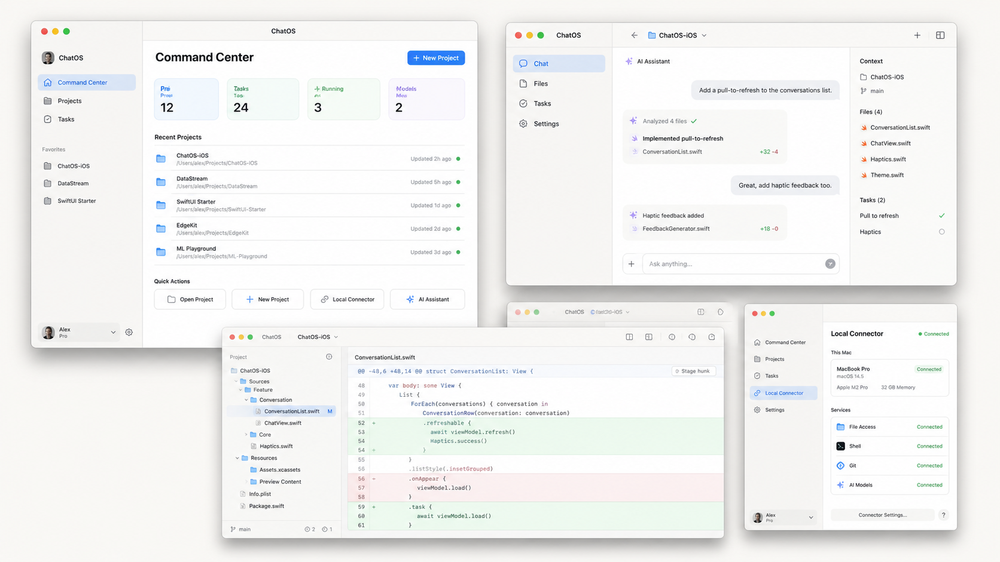

# SwiftUI 页面设计稿

这些 SVG 是结构和视觉验收基线，采用 1440×900 macOS 桌面画布。它们不是现有 React UI 的截图，也不包含真实账号、密码、Token、绝对路径或用户数据。

页面结构必须先在 [`../09-page-logic-matrix.md`](../09-page-logic-matrix.md) 中找到对应的源码组件、API、状态、操作与失败分支。设计稿只负责把已确认的业务逻辑转译成原生 macOS 体验，不新增产品实体或工作流。

## 设计稿

1. [登录](./screens/01-login.svg)
2. [全局资源导航](./screens/02-resource-shell.svg)
3. [项目用户消息与会话](./screens/03-project-user-messages.svg)
4. [项目目录、文件预览与 Git 入口](./screens/04-project-directory.svg)
5. [Plan 与 Requirement 详情](./screens/05-project-plan.svg)
6. [Requirement 执行工作台与实时任务 DAG](./screens/06-requirement-execution.svg)
7. [项目运行设置、实例与终端](./screens/07-project-run-settings.svg)
8. [Local Connector 设备配对](./screens/08-connector-device-pairing.svg)
9. [Plugin Marketplace](./screens/09-connector-plugins.svg)
10. [Local Connector 命令审批](./screens/10-connector-command-approval.svg)
11. [智能体管理](./screens/11-agent-management.svg)
12. [通过 Local Connector 创建项目](./screens/12-project-creation.svg)
13. [正常会话中的聊天历史与滚动行为](./screens/13-chat-history.svg)
14. [任务流程图完整交互](./screens/14-task-flow-graph.svg)
15. [独立记事本窗口](./screens/15-notepad.svg)
16. [远端连接与 SFTP 入口](./screens/16-remote-connection.svg)
17. [Local Connector 模型配置](./screens/17-connector-models.svg)
18. [Local Connector 运行与系统权限](./screens/18-connector-runtime-permissions.svg)
19. [Local Connector 权限控制](./screens/19-connector-sandbox.svg)
20. [系统上下文工作区](./screens/20-system-context.svg)
21. [独立用户偏好设置窗口](./screens/21-user-preferences.svg)
22. [浅色原生全宽本地终端](./screens/22-local-terminal.svg)

## 视觉方向



这张 PNG 由内置图像生成工具生成，完整提示词保存在 [visual-direction-prompt.txt](./assets/visual-direction-prompt.txt)。最终页面稿由 `generate-mockups.mjs` 生成，保证文本、尺寸和布局可重复。

## 重新生成与校验

```bash
node docs/design/generate-mockups.mjs
xmllint --noout docs/design/screens/*.svg
```
